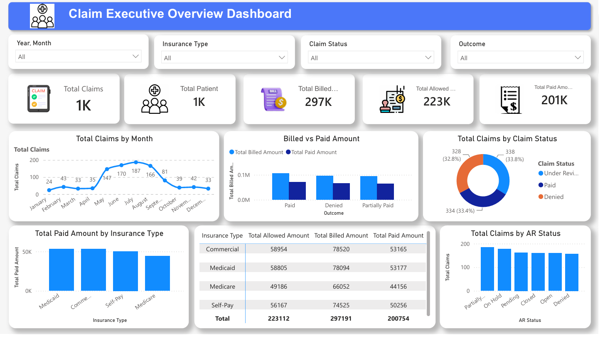

# Healthcare Claims Executive Dashboard

## Project Overview

This Power BI dashboard provides a high-level overview of healthcare claim operations and financial performance.

The dashboard helps stakeholders monitor claim volume, patient volume, payment performance, insurance-wise analysis, claim status distribution, and AR status tracking from a single view.

---

## Tools Used

- Power BI
- Power Query
- DAX
- Data Modeling

---

## Key KPIs

- Total Claims
- Total Patients
- Total Billed Amount
- Total Allowed Amount
- Total Paid Amount

---

## Visualizations

- Claims by Month
- Billed vs Paid Amount
- Claims by Claim Status
- Paid Amount by Insurance Type
- Insurance Summary Table
- Claims by AR Status

---

## DAX Measures Used

### Total Claims

```DAX
Total Claims =
DISTINCTCOUNT(claim_data[Claim ID])
```

### Total Patient

```DAX
Total Patient =
DISTINCTCOUNT(claim_data[Patient ID])
```

### Total Billed Amount

```DAX
Total Billed Amount =
SUM(claim_data[Billed Amount])
```

### Total Allowed Amount

```DAX
Total Allowed Amount =
SUM(claim_data[Allowed Amount])
```

### Total Paid Amount

```DAX
Total Paid Amount =
SUM(claim_data[Paid Amount])
```

---

## Business Questions Answered

1. How many claims were processed?
2. How many patients were served?
3. What is the total billed amount?
4. What is the total allowed amount?
5. What is the total paid amount?
6. What is the claim status distribution?
7. Which insurance types contribute the highest payments?
8. What is the AR status distribution?

---
## Skills Demonstrated

- Power BI Dashboard Development
- Data Modeling
- DAX Measures
- KPI Development
- Data Visualization
- Healthcare Claims Analysis
- Business Reporting

## Dashboard Preview

